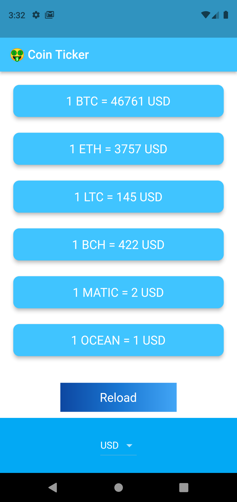

# BitcoinTicker  

A Flutter App that gives the price of different cryptocurrencies in several local currencies . 

Star⭐ the repo if you like what you see😉.

## 📸 ScreenShots

| 1 | 2|
|------|-------|
|||

| 3 ||
|------|-------|
||

## ✨ Requirements
* Any Operating System (ie. MacOS X, Linux, Windows)
* Any IDE with Flutter SDK installed (ie. IntelliJ, Android Studio, VSCode etc)
* knowledge of Dart and Flutter
* API integration (CoinApi.io)
* A brain to think 🤓🤓

## 🤓 Author(s)
**Fadowo Michael** 

